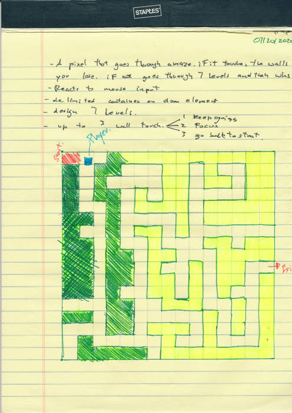

*** Name / Date ***

# Escape The Maze - Proposal

## What is Escape The Maze?

A pixel (character), goes through a maze evading the obstacles (walls). The input used will be the mouse cursor. 
If it touches wall, the user gets 2 more chances, if runs out of chances, game over, and restart.
Trying to have 7 levels (pre design, activated on previous level completition) to win the game.

## Wireframe

## Initial thoughts on game structure

(Write out what challenges you expect to encounter, or ideas you want to come up with)
- Maze creation x 7 levels
- Limiting edges (maybe array of cells that are unvalid and add to a 'lives left' counter)
- Making a pixel track cursor moves
- Game logic  - If No wall hit continue.
              - If walls hit you have 2 more lives.
                - Prompts of lifes left.
                - If out of lives, GAME OVER.
              - If exit achieved = Open next maze.
              - Repeat loop.

## Phases of Completion

(The steps or phases you expect to go through, and the tasks that you'll need to accomplish to reach each step. These should resemble the acceptance criteria we were working through earlier.)

WhiteBoard :

   - Elements
   - Logic
   - Conditions of gameFlow
   - Tools used on each step
   - Research

## Links and Resources

(Anything you've looked up so far or are thinking about using.)

- Google is your best friend.
